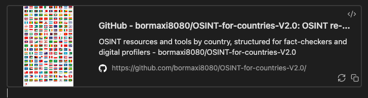
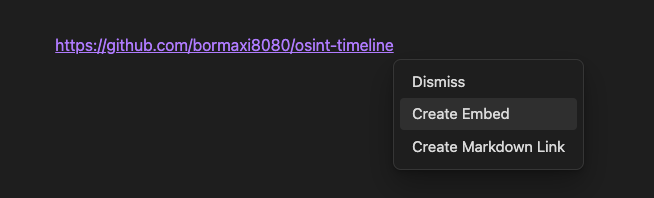

# osint-dashboard

**This project contains a set of resources on the topic of OSINT, SOftware Development and DevOps for everyday use in the work of investigators.**

- **[MAIN PROJECT PAGE](INDEX.md)**

- bormaxi8080 OSINT Weekly Timeline: https://github.com/bormaxi8080/osint-timeline

- List of GitHub OSINT Starred Repositories and Users: https://github.com/bormaxi8080/osint-repos-list/blob/main/starred_repos.md

- Fork of [@paulpogoda](https://github.com/paulpogoda) OSINT For Countries v.2.0 Repository: https://github.com/bormaxi8080/OSINT-for-countries-V2.0/

----
### PROJECT NOTES:

**IMPORTANT!** The project is integrated with the Obsidian platform () not cross-platform. The project contains links intended for previewing resources and sites that are not supported by other platforms such as

For correct display, install the **Obsidian Link Embed plugin**: https://github.com/Seraphli/obsidian-link-embed

When entering a link in Obsidian, click you will see:


If you want to generate a priview, click "Create Embed".

This creates a code:

```embed
title: "GitHub - bormaxi8080/osint-timeline: bormaxi8080 OSINT timeline weekly newseletter with collection of tools, services and investigations"
image: "https://repository-images.githubusercontent.com/622206859/c3e3ab3f-3cf2-4c02-aed4-1a9e2300c64e"
description: "bormaxi8080 OSINT timeline weekly newseletter with collection of tools, services and investigations - bormaxi8080/osint-timeline"
url: "https://github.com/bormaxi8080/osint-timeline"
favicon: "https://github.githubassets.com/favicons/favicon-dark.svg"
aspectRatio: "148.54586129753915"
```

And you will see:


If you do not want to generate a preview, click "Dismiss".
