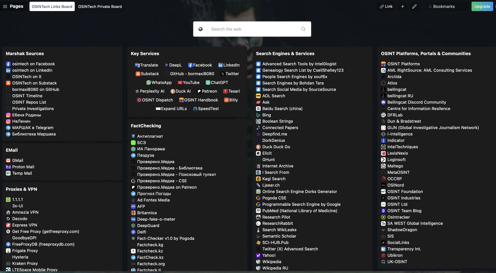
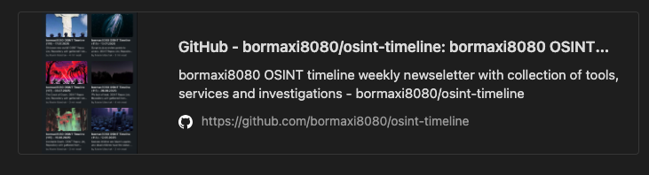
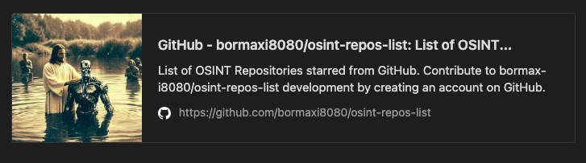

### OSINTech start.me Dashboards

Links Page Address: https://start.me/p/nRz81L/osintech-links-board

To clone dashboard open start.me service, click on Account Details > Data > Imports and import bookmarks file named [osintech_links_board.html](osintech_links_board.html)

### Related Projects:

[bormaxi8080 OSINT Timeline](https://github.com/bormaxi8080/osint-timeline)

bormaxi8080 OSINT timeline weekly newseletter with collection of tools, services and investigations.

[OSINT Repos List](https://github.com/bormaxi8080/osint-repos-list/tree/main)

This repository encapsulates a list of repositories from the GitHub, marked with an asterisk relating to the subject of OSINT, Cybersecurity, DevOps / System Administration and specific development.

